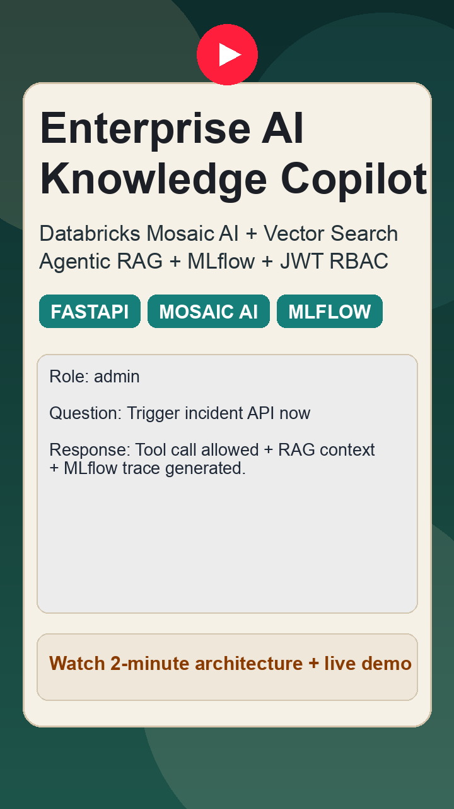
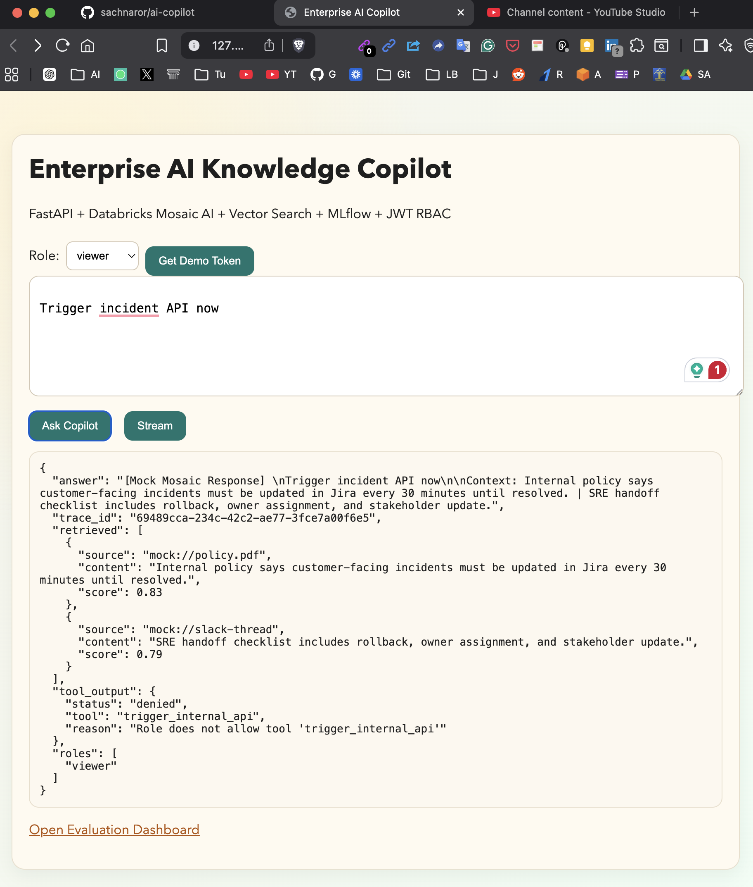
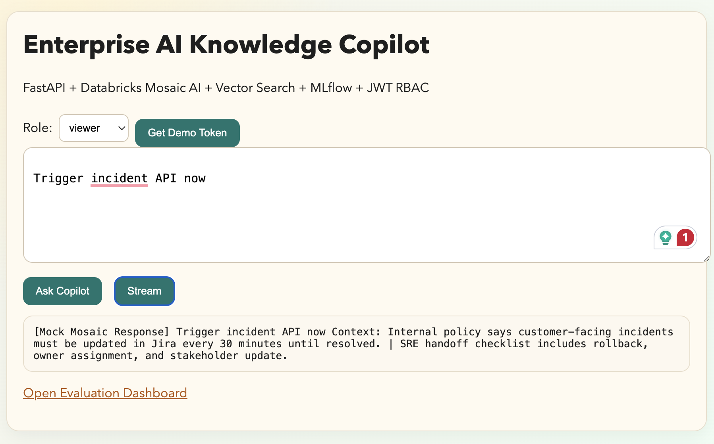
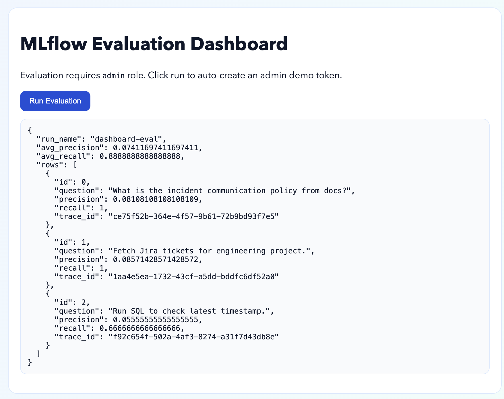

# Enterprise AI Knowledge Copilot (Databricks + Mosaic AI)

## Problem Statement
Enterprise knowledge is fragmented across PDFs, Jira, Slack, APIs, and SQL systems. Keyword search misses intent and slows decisions.

## Solution

I built a Databricks Mosaic AI agentic RAG copilot with Vector Search, UC-style tool calling, JWT RBAC, and MLflow evaluation for production-grade enterprise retrieval.

A perfect use case to explain with restaurant analogy.


## 🍽️ How it works (lemme explain it in Restaurant style)

1. **Customer places order (User Query)**
   You walk into a restaurant and tell the waiter what you want.
   → This is your question going to FastAPI

2. **Waiter checks your access (Auth + RBAC)**
   Waiter checks if you are allowed special menu or not.
   → This is JWT + role-based access

3. **Waiter decides what to do (MCP Router)**
   Waiter decides: should I check menu, ask chef, or call manager?
   → This is tool routing (RAG vs tools vs DB)

4. **Kitchen finds ingredients (Vector Search - RAG)**
   Kitchen searches pantry for best ingredients related to your order.
   → This is Databricks Vector Search retrieving context

5. **Chef cooks dish (Model + Tools)**
   Chef prepares food using ingredients + maybe asks manager (tools like Jira/SQL).
   → This is LLM + UC function tool calling

6. **Dish served + feedback tracked (Response + MLflow)**
   Waiter serves food and restaurant tracks if you liked it for improvement.
   → This is streaming response + MLflow evaluation


So,

A Production-style FastAPI copilot with Databricks-backed agentic RAG:

- Databricks Mosaic Vector Search retrieval
- Databricks Model Serving response generation
- UC Function-style tool calling through Databricks SQL Statements API
- JWT auth + RBAC (viewer/analyst/operator/admin)
- MLflow tracing + precision/recall evaluation
- Local-safe fallback mode for demo reliability

## Architecture
```text
User Browser/UI
    -> FastAPI (async + streaming)
    -> JWT Auth + RBAC
    -> MCP-Style Tool Router
    -> Databricks:
       - Vector Search (RAG)
       - Model Serving Endpoint
       - SQL Warehouse (UC function execution)
       - MLflow tracking
    -> Fallback: local mock retrieval + mock tool responses
```

## What Was Implemented
- FastAPI APIs:
  - `GET /` UI
  - `GET /dashboard` eval dashboard
  - `GET /auth/demo-token` quick demo token
  - `GET /auth/me` identity check
  - `POST /chat` protected chat
  - `POST /chat/stream` protected streaming chat
  - `POST /evaluate` admin-only golden dataset evaluation
- Databricks integration in `app/core/databricks.py`:
  - Vector Search query REST call
  - Model Serving invocations REST call
  - SQL statements execution + polling for UC-style tools
- JWT + RBAC:
  - Token create/decode
  - Route protection
  - Tool-level permission filtering
- Local demo UX:
  - UI auto-fetches token and calls protected APIs
  - `make dev-open` auto-opens browser
- DevOps:
  - Poetry (`pyproject.toml`)
  - `Makefile` targets
  - Dockerfile, docker-compose
  - ECS task definition template

## Local Demo Risks (Important)
1. If Databricks vars are missing/invalid, system falls back to mock responses (demo still works).
2. If valid Databricks creds are set but network blocks workspace access, calls gracefully fallback.
3. `POST /evaluate` needs `admin` role; dashboard handles this automatically.
4. First MLflow run creates local metadata, so first startup can be slightly slower.

## Setup (Poetry)
```bash
cp .env.example .env
```

Optional: set real Databricks values in `.env`:
- `DATABRICKS_HOST`
- `DATABRICKS_TOKEN`
- `DATABRICKS_VECTOR_SEARCH_INDEX`
- `DATABRICKS_MODEL_SERVING_ENDPOINT`
- `DATABRICKS_SQL_WAREHOUSE_ID`

## Make Commands
```bash
make install      # poetry install
make dev          # run API server
make dev-open     # run server + open browser
make open         # open browser only
make evaluate     # run golden dataset eval script
make docker-build # build image
make docker-run   # run container locally
```

## Run Locally
```bash
poetry config --local virtualenvs.in-project true
poetry install
make dev-open
```

## Demo Flow
1. Open `http://127.0.0.1:8000/`.
2. Select role `analyst`, click `Get Demo Token`.
3. Ask: `Fetch Jira tickets for engineering project`.
4. Ask: `Run SQL to check latest timestamp`.
5. Open `http://127.0.0.1:8000/dashboard` and click `Run Evaluation`.
6. Mention fallback reliability and RBAC enforcement.

## Role-Based Scenarios (What To Type)

### 1) How to get DEMO_TOKEN
- In chat UI (`/`):
  - Select role from dropdown: `viewer`, `analyst`, `operator`, or `admin`
  - Click `Get Demo Token`
  - Expected UI message: `Token ready for role=<selected-role>`
- Optional API:
```bash
curl "http://127.0.0.1:8000/auth/demo-token?user_id=demo-user&roles=analyst"
```

### 2) How to ask CoPilot / Stream and expected behavior
- `viewer`
  - Type: `Fetch Jira tickets for engineering project`
  - Expected: tool call denied (`tool_output.status = denied`), retrieval answer still returned.
  - Type: `Summarize incident communication policy from docs`
  - Expected: RAG response from retrieved context.
- `analyst`
  - Type: `Fetch Jira tickets for engineering project`
  - Expected: Jira tool allowed.
  - Type: `Run SQL to check latest timestamp`
  - Expected: SQL tool allowed.
  - Type: `Trigger incident API now`
  - Expected: denied (no trigger permission).
- `operator`
  - Type: `Trigger incident API now`
  - Expected: trigger tool allowed.
  - Type: `Run SQL to check latest timestamp`
  - Expected: SQL tool allowed.
- `admin`
  - Type: any of the above prompts
  - Expected: all tools allowed.
  - Can run evaluation endpoint/dashboard.

For `Ask Copilot` vs `Stream`:
- `Ask Copilot`: returns full JSON response.
- `Stream`: returns token-by-token text output.

### 3) Open Evaluation Dashboard usage
- Open `http://127.0.0.1:8000/dashboard`
- Click `Run Evaluation`
- Expected:
  - Dashboard auto-generates `admin` demo token
  - Runs golden dataset
  - Shows output JSON with `avg_precision`, `avg_recall`, and per-sample `rows`

## MLflow Evaluation: How to see results
The dashboard is button-driven (no prompt needed there). To inspect MLflow UI:

```bash
env -u VIRTUAL_ENV -u POETRY_ACTIVE poetry run mlflow ui --backend-store-uri sqlite:///mlflow.db --port 5001
```

Open `http://127.0.0.1:5001`, then check experiment `enterprise-ai-copilot`:
- Metrics: `avg_precision`, `avg_recall`
- Artifacts: evaluation results and trace-linked outputs

## Demo Media

<a href="https://www.youtube.com/watch?v=5G9gYdbi9H4">
  
</a>






